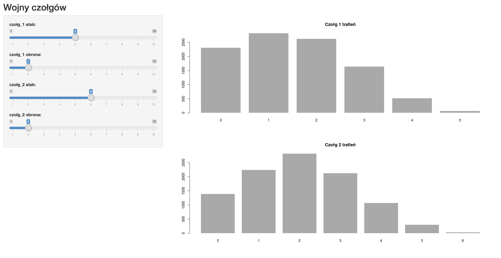

## Tanks 001

Pierwszy projekt oparty jest o grę Tanks. Pokazujemy jak wyznaczyć i pokazać rozkład trafień czołgów w tej grze.

Krótki film na youtube (kliknij by uruchomić)

Aplikacja internetowa z symulatorem trafień
https://statystyka-w-grach.shinyapps.io/Tanks/

Kody źródłowe tej aplikacji interentowej
[app.R](app.R)

Kody źródłowe pojedynczej symulacji 
[czolgi.R](czolgi.R)

